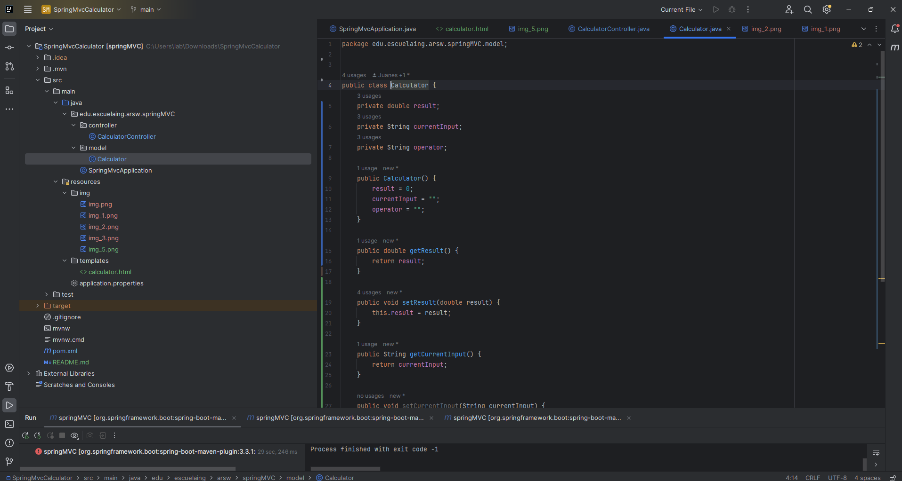
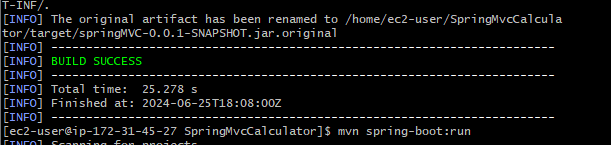

# Calculator Application

This project is a simple calculator web application built using Maven and Spring Boot. It allows multiple users to perform basic arithmetic operations through a web interface.

## Features

- Perform addition, subtraction, multiplication, and division.
- Maintain session-specific calculations for each user.

## Project Structure


## Calculator

Represents the calculator's state including the current result, input, and operator. It handles basic arithmetic operations.


## CalculatorController

Handles HTTP requests, performs calculations based on user input, and manages sessions for multiple users.



## Deployment


### Prerequisites

- JDK 11 or higher
- Maven
- Amazon EC2 instance (for deployment)

### Deployment 

Amazon EC2

## Architecture

The calculator application follows a typical web application architecture using the Spring Boot framework, ensuring scalability, maintainability, and ease of deployment. Here’s a breakdown of its key components:

### Frontend
The frontend utilizes Thymeleaf templates for rendering dynamic HTML content. This allows for a responsive user interface that interacts seamlessly with the backend services.

### Backend

#### Controller Layer
The `CalculatorController` handles incoming HTTP requests, processes user inputs, and coordinates with the service layer to perform arithmetic operations. It manages sessions to maintain state across multiple user interactions.

#### Service Layer
The `CalculatorService` encapsulates the core business logic of arithmetic operations (addition, subtraction, multiplication, division). It ensures that calculations are performed accurately and efficiently.

#### Session Management
Spring Session is leveraged to manage user sessions securely. This ensures that each user interaction with the calculator is isolated and maintains its own calculation state.

### Deployment Architecture
The application is deployed on an Amazon EC2 instance, taking advantage of its scalability and reliability. The deployment involves packaging the application into a JAR file and transferring it to the EC2 instance. It runs on Java 11, ensuring compatibility and performance.

### Technologies Used
- **Java**: The primary programming language for backend development.
- **Spring Boot**: Provides a robust framework for building web applications, including dependency management and configuration.
- **Maven**: Used for project management and build automation.
- **Thymeleaf**: Enables server-side rendering of HTML templates with support for dynamic data.
- **Amazon EC2**: Cloud computing service used for hosting the application, providing scalability and reliability.


**Build the Project**

   ```bash
   mvn clean package
   ```

**Deploy to Amazon EC2**

    - Launch an Amazon EC2 instance with Java installed.
    - Copy the generated `target/calculator-springboot.jar` to your EC2 instance.

**Use the Calculator**

    - Enter numbers and perform calculations using the calculator interface.


## Author

Juan Esteban Ortiz


