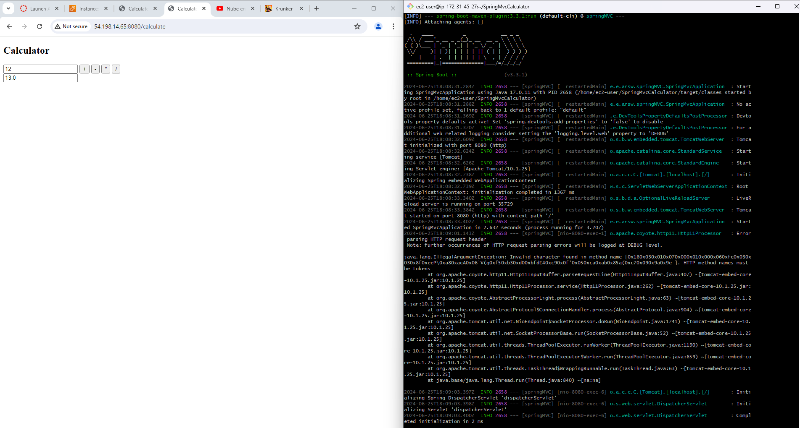

# Calculator Application

This project is a simple calculator web application built using Maven and Spring Boot. It allows multiple users to perform basic arithmetic operations through a web interface.

## Features

- Perform addition, subtraction, multiplication, and division.
- Maintain session-specific calculations for each user.
- Responsive UI using Thymeleaf templates.

## Project Structure


## Calculator

Represents the calculator's state including the current result, input, and operator. It handles basic arithmetic operations.


## CalculatorController

Handles HTTP requests, performs calculations based on user input, and manages sessions for multiple users.


## Deployment


### Prerequisites

- JDK 11 or higher
- Maven
- Amazon EC2 instance (for deployment)

### Deployment 

Amazon EC2


2. **Build the Project**

   ```bash
   mvn clean package
   ```

3. **Deploy to Amazon EC2**

    - Launch an Amazon EC2 instance with Java installed.
    - Copy the generated `target/calculator-springboot.jar` to your EC2 instance.


4**Use the Calculator**

    - Enter numbers and perform calculations using the calculator interface.

## Technologies Used

- Java
- Spring Boot
- Maven
- Thymeleaf
- Amazon EC2

## Author

Juan Esteban Ortiz


